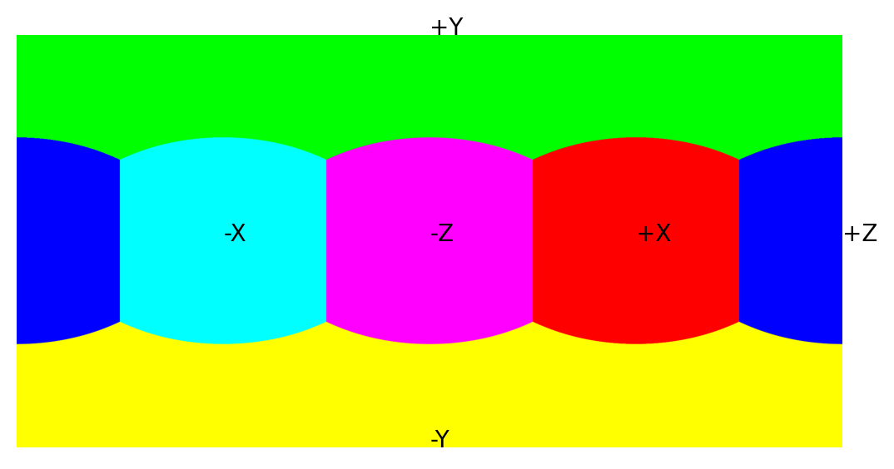

## skylibs

Tools used for LDR/HDR environment map (IBL) handling, conversion and I/O.


### Install & Develop

Install using:
```
pip install --upgrade skylibs
```

To develop skylibs, clone the repository and execute `python setup.py develop`


### OpenEXR & Spherical harmonics

To read and save `exr` files, install the following dependencies (works on win/mac/linux):

```
conda install -c conda-forge openexr-python openexr
```


### Spherical Harmonics

To use the spherical harmonics functionalities, install the following dependency (works on mac/linux):

```
conda install -c conda-forge pyshtools
```

### envmap

Example usage:
```
from envmap import EnvironmentMap

e = EnvironmentMap('envmap.exr', 'latlong')
e_angular = e.copy().convertTo('angular')
e_angular_sa = e_angular.solidAngles()
```

`envmap.EnvironmentMap` Environment map class. Converts easily between those formats:

- latlong (equirectangular)
- angular 
- sphere
- cube
- skyangular
- skylatlong

#### Coordinates system

Skylibs employs the following right-handed coordinates system: +X = right, +Y = up, +z = towards the camera. Here is its latitude-longitude map (see code below):




#### Available methods:

- `.copy()`: deepcopy the instance.
- `.solidAngles()`: provides the solid angle for each pixel of the current representation.
- `.convertTo(targetFormat)`: convert to the `targetFormat`.
- `.rotate(rotation)`: rotate the environment map using a Direction Cosine Matrix (DCM).
- `.resize(targetHeight)`: resize the environment map. Down-scaling will use energy-preserving interpolation (best results with integer downscales), which may introduce aliasing.
- `.toIntensity(mode, colorspace)`: convert to grayscale.
- `.getHemisphere(normal)`: returns a mask of the hemisphere visible from a surface with `normal`.
- `.setHemisphereValue(normal, value)`: sets all pixels visible from a surface with `normal` to `value`.
- `.getMeanLightVectors(normals)`: compute the mean light vector of the environment map for the given normals.
- `.project(vfov, rotation_matrix, ar, resolution, projection, mode)`: Extract a rectified image from the panorama, simulating a camera with field-of-view `vfov`, extrinsics `rotation_matrix`, aspect ratio `ar`, `resolution`.
- `.embed(self, vfov, rotation_matrix, image)`: inverse of `project`, embeds an image in the environment map.
- `.imageCoordinates()`: returns the (u, v) coordinates at each pixel center.
- `.worldCoordinates()`: returns the (x, y, z, valid) world coordinates for each pixel center, with mask `valid` (anything outside this mask does not project to the world).
- `.world2image(x, y, z)`: returns the (u, v) coordinates of the vector (x, y, z). Pixel coordinates can be obtained with `floor(u)` and `floor(v)`.
- `.image2world(u, v)`: returns the (x, y, z) coordinates of the coordinates (u, v).
- `.interpolate(u, v, valid)`: interpolates the envmap to coordinates (u, v) masked with valid.


### Projection, cropping, simulating a camera

To perform a crop from `pano.jpg`:

```
import numpy as np
from imageio import imread, imsave
from envmap import EnvironmentMap, rotation_matrix


e = EnvironmentMap('pano.jpg', 'latlong')

dcm = rotation_matrix(azimuth=np.pi/6,
                      elevation=np.pi/8,
                      roll=np.pi/12)
crop = e.project(vfov=85., # degrees
                 rotation_matrix=dcm,
                 ar=4./3.,
                 resolution=(640, 480),
                 projection="perspective",
                 mode="normal")

crop = np.clip(255.*crop, 0, 255).astype('uint8')
imsave("crop.jpg", crop, quality=90)
```

### hdrio

`imread` and `imwrite`/`imsave` supporting the folloring formats:

- exr (ezexr)
- cr2, nef, raw (dcraw)
- hdr, pic (custom, beta)
- tiff (tifffile)
- All the formats supported by `imageio`

### ezexr

Internal exr reader and writer, relies on `python-openexr`.

### tools3d

- `getMaskDerivatives(mask)`: creates the dx+dy from a binary `mask`.
- `NfromZ`: derivates the normals from a depth map `surf`.
- `ZfromN`: Integrates a depth map from a normal map `normals`.
- `display.plotDepth`: Creates a 3-subplot figure that shows the depth map `Z` and two side views.
- `spharm.SphericalHarmonic` Spherical Harmonic Transform (uses `pyshtools`).

    Example usage of `spharm`:
    ```
    from envmap import EnvironmentMap
    from tools3d import spharm

    e = EnvironmentMap('envmap.exr', 'latlong')
    sh = spharm.SphericalHarmonic(e)
    print(sh.coeffs)
    reconstruction = sh.reconstruct(height=64)
    ```
- `warping_operator.warpEnvironmentMap`: The warping operator of [Gardner et al., 2017](https://dl.acm.org/doi/10.1145/3130800.3130891). See documentation [here](./tools3d/warping_operator/README.md).

### hdrtools

Tonemapping using `pfstools`.

## Changelog

- 0.7.6: Fixed division by zero in envmap projection's mask mode.
- 0.7.5: Fixed spherical harmonics import with latest pyshtools, added spherical warping operator, added whitelist channels in `ezexr`.
- 0.7.4: Fixed tools3d.spharm compatibility with latest pyshtools.
- 0.7.3: Added vMF-based envmap blur functionality. `ezexr` does not print the number of channels on stdout.
- 0.7.2: `ezexr.imwrite()` now orders correctly channels when > 10 are used.
- 0.7.1: Added `sunFromPySolar` (Thank Ian!) and support for alpha values and imageio v3 in ezexr(thanks Hong-Xing!).
- 0.7.0: Fixed `.setHemisphereValue()`, added mode to `.toIntensity()`, fixed angular and sphere projections for normals [0, 0, ±1], added `.getHemisphere(normal)`.
- 0.6.8: Fixed resizing to be energy-preserving when downscaling; fixed conversion that shifted the envmap by half a pixel
- 0.6.7: Fixed image envmap embedding to fit the projection coordinates; fixed crash in imwrite with specific channel names
- 0.6.6: Fixed aspect ratio when embedding
- 0.6.5: Added envmap embed feature
- 0.6.4: Removed `pyshtools` as mandatory dependency
- 0.6.3: Removed custom OpenEXR bindings (can be easily installed using conda)
- 0.6.2: Removed `rotlib` dependency
- 0.6.1: Aspect ratio in `project()` now in pixels
- 0.6: Updated the transport matrix Blender plugin to 2.8+


## Roadmap

- Improved display for environment maps (change intensity with keystroke/button)
- Standalone `ezexr` on all platforms (investigate `pyexr`)
- add `worldCoordinates()` output in spherical coordinates instead of (x, y, z)
- Add assert that data is float32 in convertTo/resize (internal bugs in scipy interpolation)


### Code for the coordinates system figure

```
import numpy as np
from matplotlib import pyplot as plt
from envmap import EnvironmentMap

sz = 1024
e = EnvironmentMap(sz, 'cube', channels=3)
e.data[:sz//4,:,:] = [0, 1, 0]                   # +Y
e.data[sz//4:int(0.5*sz),:,:] = [1, 0, 1]        # -Y
e.data[:,int(0.5*sz):,:] = [1, 0, 0]             # +X
e.data[:,:int(0.25*sz),:] = [0, 1, 1]            # -X
e.data[int(3/4*sz):,:,:] = [0, 0, 1]             # +Z
e.data[int(0.5*sz):int(3/4*sz):,:,:] = [1, 1, 0] # -Z
e.convertTo('latlong')

def getCoords(normal):
    u, v = e.world2image(*normal)
    return [u*e.data.shape[1], v*e.data.shape[0]]

plt.imshow(e.data)
plt.text(*(getCoords([1, 0, 0]) + ["+X"]))
plt.text(*(getCoords([-1, 0, 0]) + ["-X"]))
plt.text(*(getCoords([0, 1, 0]) + ["+Y"]))
plt.text(*(getCoords([0, -1, 0]) + ["-Y"]))
plt.text(*(getCoords([0, 0, 1]) + ["+Z"]))
plt.text(*(getCoords([0, 0, -1]) + ["-Z"]))
plt.axis('off')
plt.savefig('coordinates.png', bbox_inches="tight", dpi=200)
plt.show()
```